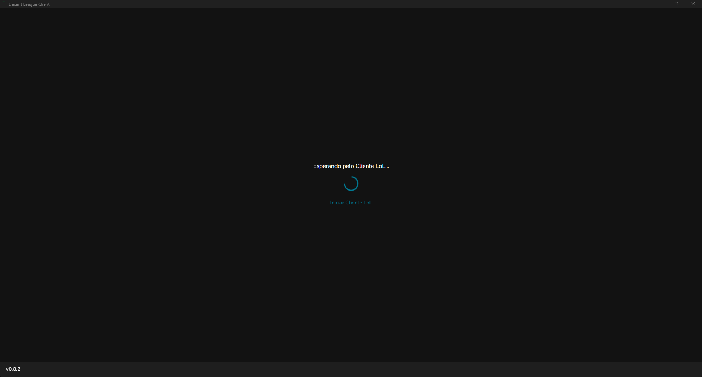
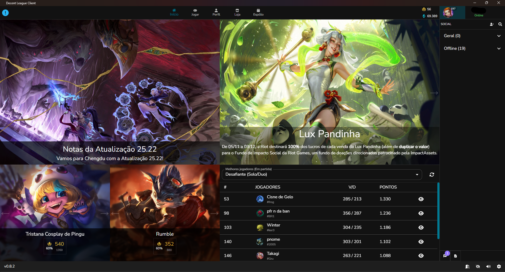
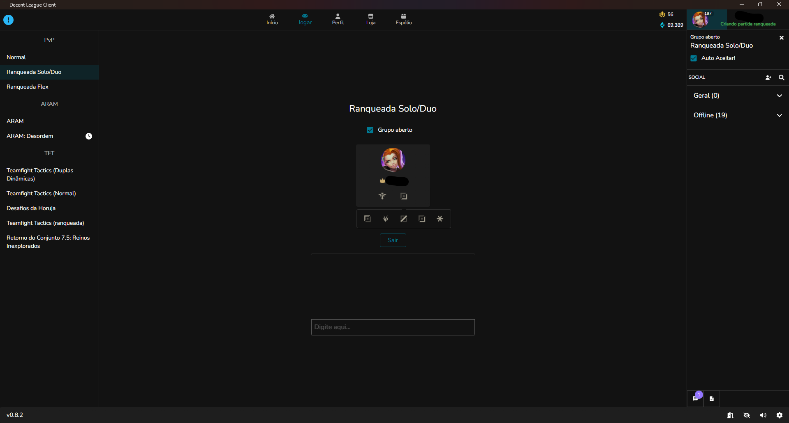
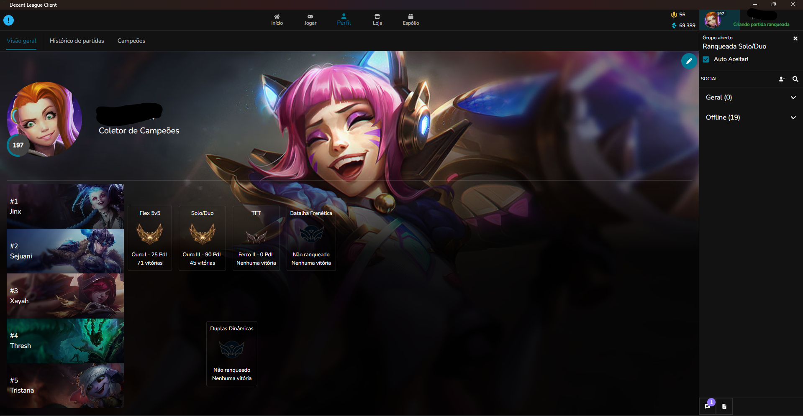
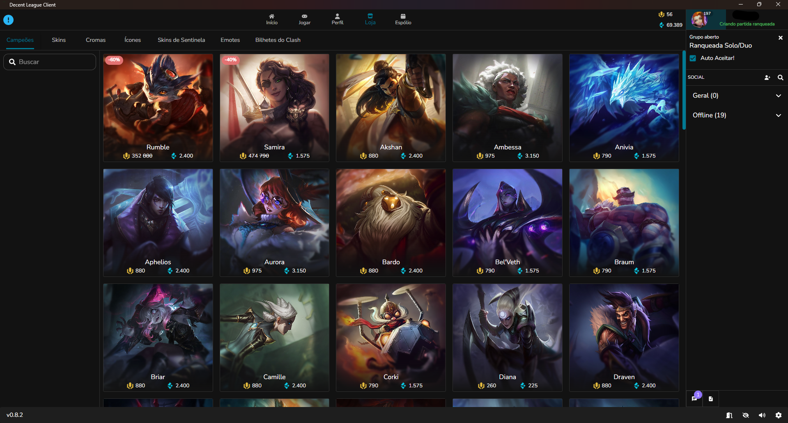
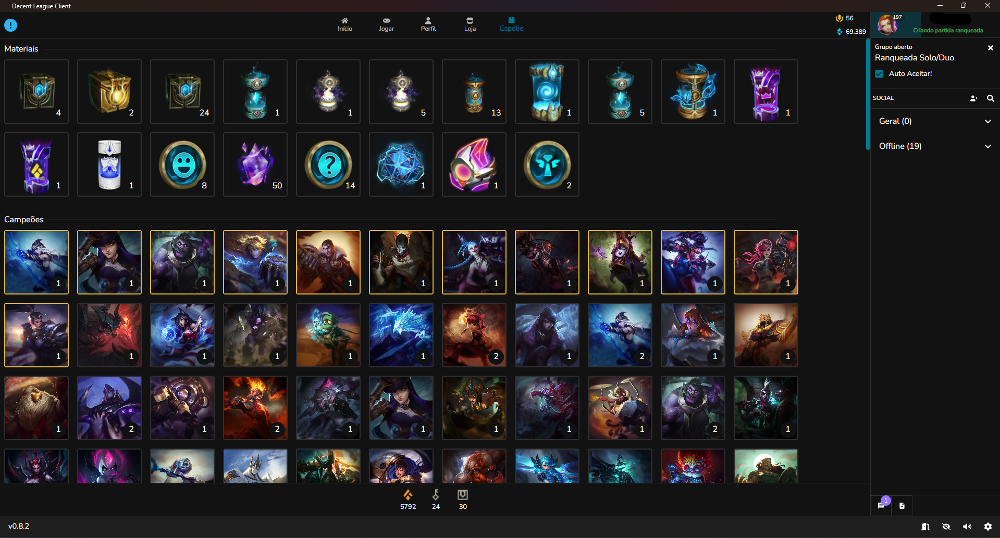
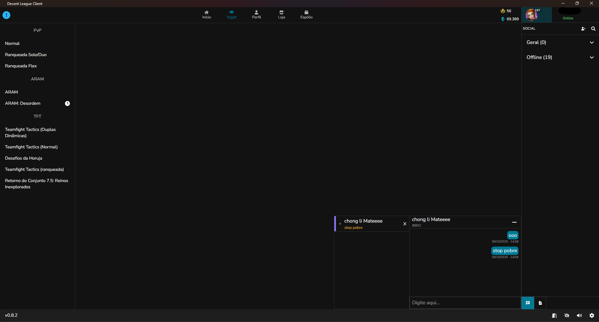
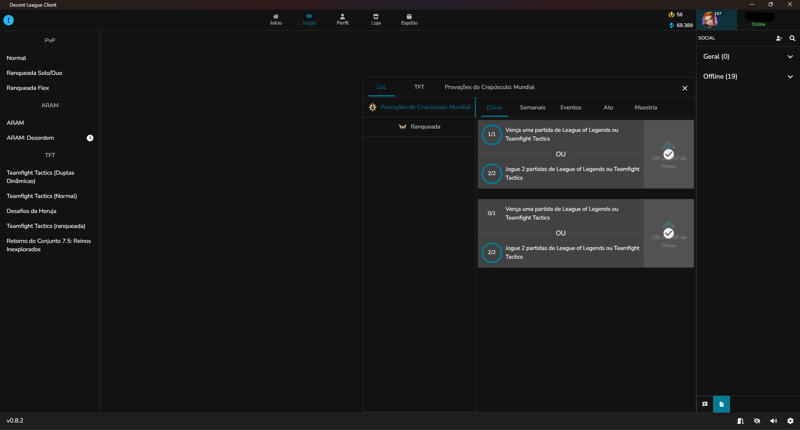

# Custom League Client

A custom League client controller to improve the client's usage and, possibly, automation.<br>
Build with Electron, React, NestJS, TypeScript and [LeagueConnect](https://github.com/junlarsen/league-connect)

# Gallery

> Note: Language is same of your league client. So, as I am brazilian, my league client language is pt/br.










## How to install

Download latest version in [Release](https://github.com/caiovini980/custom-league-client/releases), install and configure Riot Client path.

> **Select "Riot Client" folder in configuration screen**
>
> Default Path: C:\Riot Games\Riot Client
>
> If your changed location of league of legends when installed, you need know and put correct path.
> In my case, D:\Riot Games\Riot Client


## Project Setup (To developers)

> It's need of [Pnpm](https://pnpm.io/) with package manager

### Install

```bash
$ pnpm install
```

### Development

```bash
$ pnpm run dev
```

### Build

```bash
# For windows
$ pnpm run build:win
```

# Links

- [Community Dragon Docs](https://www.communitydragon.org/documentation)
- [Community Dragon Directory Downloader](https://github.com/BlossomiShymae/snip-snip)
- [Community Dragon Raw](https://raw.communitydragon.org/)
- [Hextechdocs](https://hextechdocs.dev/)
- [Riot Games LoL Docs](https://developer.riotgames.com/docs/lol)
- [JSON to TS](https://transform.tools/json-to-typescript)
